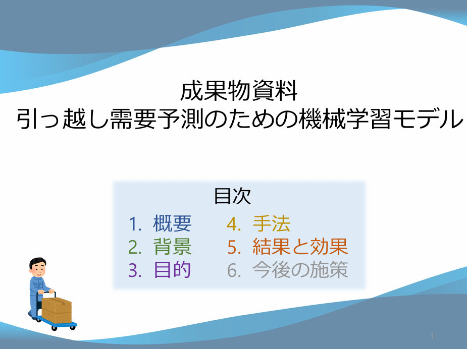

# 引っ越し需要予測のための機械学習モデル
## 概要
引越し業者が時期ごとの最適な人員配置・価格設定を行うためのツールとして、機械学習を利用した受注件数の予測モデルを開発  

最終的なモデルは
- 長期的な件数変動のトレンドを捉えるモデル  
- 日々の細かい件数の変動を捉えるモデル  

2つの基本モデルを組み合わせて構築  

予測誤差は平均して±7件程度と高精度であり、引っ越し需要の予測に有用であることが示された  
今後本モデルを発展させ、さらなる引っ越し業界の課題解決に役立つことが期待される  

※本予測モデルの構築は[SIGNATEのコンペ「アップル 引越し需要予測」](https://user.competition.signate.jp/ja/competition/detail/?competition=ada98a13ab224468b1c7191d819d7646)を題材として行いました  

### 説明資料
スライドによる概要の説明は以下からご覧ください。  
[](https://t0bbut.github.io/signate_apple_hikkosi_analysis/成果物資料_引っ越し需要予測.pdf)

## notebookの閲覧について
notebookフォルダ内にEDAやモデル構築に使ったノートブックが配置されていますが、出力は消してあります。  
出力を含めたノートブック全体の様子は以下からご確認下さい。  
- [EDA](https://t0bbut.github.io/signate_apple_hikkosi_analysis/EDA.html)
- [model1](https://t0bbut.github.io/signate_apple_hikkosi_analysis/model1.html)
- [model2](https://t0bbut.github.io/signate_apple_hikkosi_analysis/model2.html)

## 環境の再現方法
このリポジトリは **Python 3.11.9** で動作確認しています。  
以下の手順で仮想環境を構築し、依存ライブラリをインストールできます。  

```bash
git clone https://github.com/T0bbuT/signate_apple_hikkosi_analysis.git
cd signate_apple_hikkosi_analysis

# 仮想環境の作成
python -m venv .venv

# 仮想環境の有効化
source .venv/bin/activate   # Windows の場合は .venv\Scripts\activate

# 依存ライブラリのインストール
pip install -r requirements.txt
```
### データについて
その後、[コンペサイト](https://user.competition.signate.jp/ja/competition/detail/?competition=ada98a13ab224468b1c7191d819d7646)からデータをダウンロードし、data\input\に配置して実行しておりました。  
※ 2025/08/30現在、コンペは既に開催終了しておりデータへのアクセスは不可能のため、完全な再現はできません。代わりにダミーデータを配置する予定です。コードの流れを読む用途にご利用ください。
